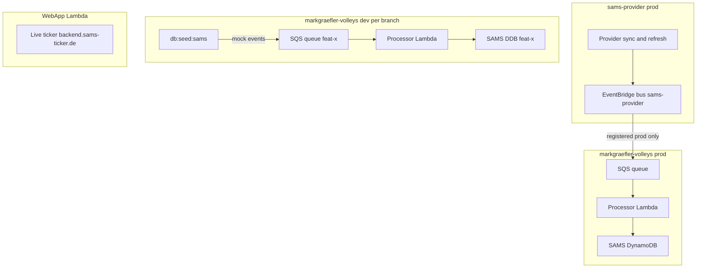

# SAMS Provider Consumer Migration (#64)

Implementation plan for [issue #64](https://github.com/terijaki/markgraefler-volleys/issues/64).

## Context

Migrates this repo from self-contained SAMS sync (local Lambdas + `SAMS_API_KEY`) to **event-fed local projections** from the external [`sams-provider`](https://github.com/terijaki/sams-provider) service.

**Prerequisites (done):**

- [#63](https://github.com/terijaki/markgraefler-volleys/issues/63) / [#66](https://github.com/terijaki/markgraefler-volleys/pull/66): `sams-rest-v2` client
- Provider platform implemented and publishing events

**Event contract:** Use [`sams-provider-events`](https://www.npmjs.com/package/sams-provider-events) (`^0.2.0`) for types, Zod schemas, `SamsEventType`, and `parseSamsEventFromSqsBody()`. Do **not** duplicate schemas locally. See [provider event docs](https://github.com/terijaki/sams-provider/blob/main/docs/consumers/events.md).

**Published events to handle:**

| Event type | Local projection action |
|------------|-------------------------|
| `sams.club.updated` | Upsert club metadata |
| `sams.club-season-teams.updated` | Replace club/season team list |
| `sams.club-season-rosters.updated` | Replace club/season roster snapshot |
| `sams.team-roster.updated` | Upsert single team roster |
| `sams.club-match-schedule.updated` | Replace club schedule |
| `sams.match-block.updated` | Upsert matches in block |
| `sams.league-ranking.updated` | Replace league ranking table |
| `sams.clubs.sync.completed` | Optional ops metadata |
| `sams.teams.sync.completed` | Optional ops metadata |

Reserved types — ignore gracefully.

**Live ticker:** Unchanged. Public feed from `backend.sams-ticker.de` via plain `fetch()` in `app/src/server/functions/sams.server.ts`. No `SAMS_API_KEY`.

**Rollout:** One-shot cutover per environment. No feature flag. PR removes sync Lambdas and switches reads to projections.

## Target architecture

**Dev/prod split:** Prod receives real provider events. Dev uses **branch-scoped queues fed by seeded mock events** — no provider registration on dev.



| Resource | Stack | Scope | Notes |
|----------|-------|-------|-------|
| SQS queue + DLQ | `SamsStack` | Branch-scoped (dev) / singleton (prod) | Like mail-forward DLQ — **not** a separate infra stack |
| Processor Lambda | `SamsStack` | Same as queue | Always has SQS event source mapping |
| Queue policy (cross-account) | `SamsStack` | **Prod only** | Allows provider EventBridge bus `sqs:SendMessage` |
| Mock event seed | `scripts/seed-sams-provider-events.ts` | Dev only | Replaces `data-trigger-syncs.ts` |

### Account mapping

| Role | Account ID |
|------|------------|
| Provider (event source) | `550271577754` |
| Our dev | `926634327887` — **not registered**; mock events via seed |
| Our prod | `883425316554` — **registered** with provider prod |

Registration club name: `Markgräfler Volleys` (`project.config.ts`).

### Why this works

- Each feature branch gets its own queue → processor → DynamoDB. **No competing consumers.**
- No `CDK_SAMS_PROVIDER_PROCESSOR`, no shared queue, no `SamsProviderInfraStack`.
- Dev E2E tests the full queue → processor → DB pipeline via seed (local + CI).
- Prod validates real cross-account EventBridge → SQS delivery once.

---

## Implementation (PR scope)

### 0. Add dependency — `sams-provider-events`

```bash
vp install sams-provider-events
```

### 1. Shared naming module — `lib/sams-provider-env.ts`

- `computeSamsProviderEventsQueueName(environment, branch)`
- `computeSamsProviderEventsDlqName(environment, branch)`
- `getProviderEventBusArn()` → provider prod bus ARN (`550271577754`, `eu-central-1`)
- Branch suffix on dev via `computeResourceBranchSuffix`; none on prod

### 2. Extend `SamsStack` — queue, processor, decommission

- **Remove** sync Lambdas, EventBridge schedules, and `SAMS_API_KEY`
- **Add** SQS queue + DLQ (`RemovalPolicy.RETAIN` on prod)
- **Add** queue resource policy **on prod only**
- **Add** processor Lambda with SQS event source (`reportBatchItemFailures: true`)
- **Add** DLQ CloudWatch alarm
- Export queue URL/ARN as stack outputs

### 3. Event processor Lambda — `lambda/sams/sams-provider-events.ts`

- `parseSamsEventFromSqsBody(record.body)` + dispatch on `SamsEventType.*`
- Idempotency via `snapshotVersion`
- Map to existing repos + match/ranking projection storage
- Unit tests with fixture SQS bodies

### 4. Dev seed script — replace `data-trigger-syncs.ts`

Create `scripts/seed-sams-provider-events.ts` (wire as `db:seed:sams`):

- **Dev only** — refuse to run on prod
- Resolve queue URL from `cdk-outputs.json` or naming + `getSanitizedBranch()`
- Build mock events from `sams-provider-events` fixtures
- Wrap in EventBridge SQS format: `{ "detail": { …envelope } }`
- `SendMessageBatch` to branch queue
- **Poll DynamoDB** until expected projections exist (timeout ~60s) — required for CI reliability
- Shared fixtures: `scripts/fixtures/sams-provider-events.ts`

`vite.config.ts` dev bootstrap already runs `db:seed:sams`.

### 5. Dev CI seeding — `.github/workflows/cdk-deploy.yml`

Add step **after `CDK Deploy`, before `E2E Tests`** (dev branches only):

```yaml
- name: Seed SAMS provider mock events
  if: github.ref != 'refs/heads/main'
  env:
    CDK_BRANCH_OVERWRITE: ${{ github.ref_name }}
    CDK_ENVIRONMENT: dev
  run: vp run db:seed:sams
```

**IAM:** Add SQS permissions to dev `GitHubActionsCDKRole` (`sqs:SendMessage`, `sqs:GetQueueUrl` on branch queues). Current policy in `docs/SETUP.md` lacks SQS.

**Async handling:** Seed script polls DynamoDB after `SendMessageBatch` so E2E does not race the processor. Exit non-zero on timeout → fails pipeline.

**Prod guard:** Skip on `main` — prod receives real provider events after registration, never mocks.

### 6. Read-path migration

- `sams.server.ts`: read matches, rankings, clubs, teams from local projections
- **Keep** live ticker unchanged (`backend.sams-ticker.de`)
- Remove `SAMS_API_KEY` from webapp stack and `.env.schema`
- Remove SAMS proxy Lambdas
- Admin SAMS dashboard: remove manual sync; show freshness metadata

### 7. Documentation — `docs/SAMS_PROVIDER_CONSUMER.md`

Update `docs/SETUP.md`, `lib/AGENTS.md`, `docs/adr/0001-sams-match-loading.md`.

---

## Operational rollout

### Phase A — Implement and open PR

1. Branch `terijaki/sams-provider-consumer-b562`
2. Implement items 0–7
3. `vp check` + `vp test`
4. Open draft PR referencing #64

### Phase B — Test on feature branch (dev account)

No provider registration needed. CI runs seed automatically after deploy.

1. Deploy feature branch (CI)
2. CI seeds mock events → branch queue → processor → DynamoDB
3. Validate: admin SAMS dashboard, `/matches`, `/tabelle`, team pages, live ticker, empty DLQ

### Phase C — Merge PR to main

1. Merge after dev E2E passes
2. CI deploys `main` to shared dev + seeds mocks
3. Confirm site works end-to-end

### Phase D — Prod deploy + registration

1. CI deploys prod (`SamsStack-Prod` with cross-account queue policy)
2. Capture prod queue ARN from stack output
3. File "Register as a consumer" issue on `terijaki/sams-provider` (club `Markgräfler Volleys`, account `883425316554`, queue ARN)
4. Verify real events after provider sync; monitor DLQ

**No dev account registration.**

---

## Files to create / modify

| Action | File |
|--------|------|
| **Create** | `lib/sams-provider-env.ts`, tests |
| **Create** | `lambda/sams/sams-provider-events.ts`, tests |
| **Create** | `scripts/seed-sams-provider-events.ts`, `scripts/fixtures/sams-provider-events.ts` |
| **Create** | `docs/SAMS_PROVIDER_CONSUMER.md` |
| **Modify** | `package.json`, `lib/sams-stack.ts`, `sams.server.ts`, admin SAMS page |
| **Modify** | `.github/workflows/cdk-deploy.yml`, `docs/SETUP.md` (SQS IAM) |
| **Remove** | `data-trigger-syncs.ts`, sync Lambdas, SAMS proxy Lambdas, `SAMS_API_KEY` |

**Not created:** `SamsProviderInfraStack`, `CDK_DEPLOY_SAMS_PROVIDER_INFRA`, `CDK_SAMS_PROVIDER_PROCESSOR`

---

## Risks and mitigations

| Risk | Mitigation |
|------|------------|
| Mock fixtures drift from provider | `sams-provider-events` schemas; pin version; contract tests |
| Dev doesn't test real provider delivery | Prod registration + soak |
| CI races processor | Seed script polls DynamoDB |
| Missing SQS IAM on CI role | Add to dev `GitHubActionsCDKRole` |
| Prod queue lost on stack change | `RemovalPolicy.RETAIN` on prod queue/DLQ |
| Ticker regression | Separate public feed; verify in E2E |

---

## Success criteria

- Branch-scoped queue + processor in `SamsStack` on every deployment
- Dev CI auto-seeds mock events after deploy; parallel feature branches work
- Prod queue registered on provider prod; real events flow after registration
- Processor uses `sams-provider-events`
- Website serves clubs, teams, matches, rankings from local projections
- Live ticker unchanged; `SAMS_API_KEY` removed entirely
- Sync Lambdas and direct SAMS API read paths removed
